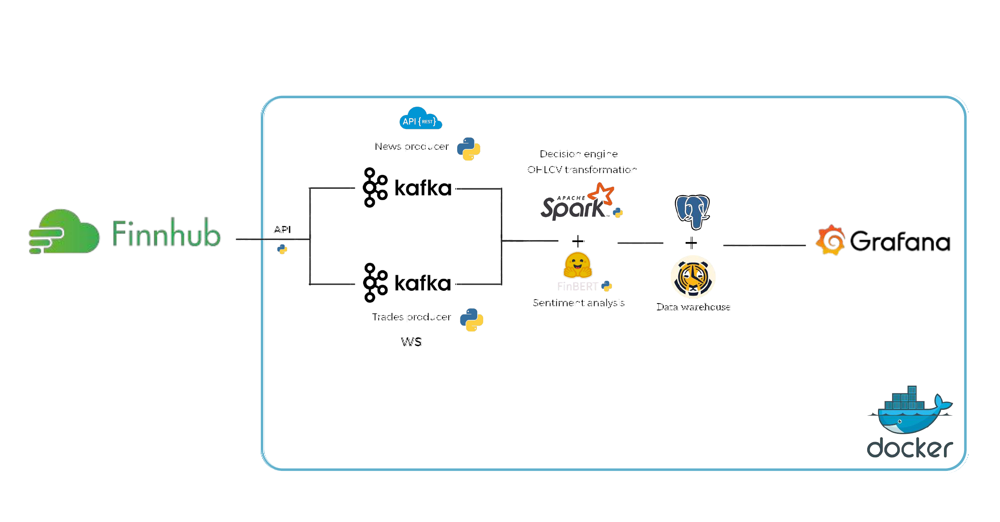

# Real-Time News-Driven Trading Pipeline

Pipeline d'ingénierie de données de bout en bout : ingestion Finnhub
(WebSocket et REST), scoring de sentiment FinBERT, décisions de trading
automatiques, restitution Grafana — orchestré par Docker Compose.



## Comment ça marche

| Couche | Composant | Rôle |
|---|---|---|
| Ingestion | `trade_producer`, `news_producer` | Finnhub WS et REST → Kafka |
| Bus | Apache Kafka | topics `trades`, `news`, `news_enriched` |
| NLP | `streaming_nlp` (FinBERT) | sentiment par dépêche, ~150 ms |
| Décision | `decision_engine` | cache de sentiment + cycle de position |
| Stockage | PostgreSQL + TimescaleDB | hypertables, signaux, positions |
| Analytique (option) | Spark Streaming | chandelles OHLCV 1m / 5m |
| Restitution | Grafana | tableau de bord temps réel |

## Démarrage

Prérequis : Docker Desktop, une clé API Finnhub gratuite.

```bash
git clone https://github.com/Soufix-jr/End-to-end-data-eng-pipeline-.git
cd End-to-end-data-eng-pipeline-
cp .env.example .env            # renseignez FINNHUB_API_KEY
make up-nlp                     # infra + producteurs + NLP + décisions
make up-dash                    # ajoute Grafana sur :3000 (admin/admin)
make smoke                      # comptes par table
```

Sur Windows, `make.bat` est fourni pour les mêmes cibles.

## Profils Docker Compose

| Profil | Services |
|---|---|
| `infra` | Kafka, Postgres |
| `ingest` | + producteurs et `db_consumer` |
| `nlp` | + `streaming_nlp`, `decision_engine` |
| `dashboard` | + Grafana |
| `spark` | + Spark master/worker |
| `full` | tout |

## Décision en bref

1. Une dépêche arrive ; FinBERT la score (`positive 0.94`).
2. Le sentiment est ajouté au cache du symbole avec décroissance
   exponentielle (demi-vie 30 min).
3. Au prochain tick, si le sentiment agrégé dépasse `OPEN_THRESHOLD`,
   une position est ouverte avec cible (`+TARGET_PCT`) et stop
   (`-STOP_PCT`).
4. À chaque tick suivant, la cible, le stop ou l'expiration sont
   testés ; à la clôture, le P&L est calculé.

## Configuration (`.env`)

| Variable | Défaut | Rôle |
|---|---|---|
| `OPEN_THRESHOLD` | `0.4` | magnitude minimale pour ouvrir |
| `TARGET_PCT` | `0.01` | distance prise de profit (1 %) |
| `STOP_PCT` | `0.005` | distance stop (0.5 %) |
| `HORIZON_MINUTES` | `240` | expiration |
| `SENTIMENT_HALF_LIFE_S` | `1800` | décroissance du cache |
| `SYMBOLS` | `AAPL,MSFT,TSLA,NVDA,AMZN` | univers |

## Tableau de bord

Le dashboard Grafana est provisionné automatiquement à
http://localhost:3000 (admin/admin) :
- KPI : P&L 24h, taux de réussite, positions ouvertes, articles scorés
- Marché : prix par symbole, distribution de sentiment, trades/min
- Décisions : journal des signaux, positions ouvertes et fermées

## Schéma

| Table | Contenu |
|---|---|
| `raw_trades` | ticks Finnhub (hypertable) |
| `raw_news` | articles dédupliqués |
| `nlp_results` | sentiment FinBERT par article |
| `signals` | journal des décisions |
| `positions` | cycle de vie complet, P&L |
| `ohlcv_1m`, `ohlcv_5m` | chandelles Spark |

## Hors heures de marché

Finnhub WebSocket ne diffuse les ticks qu'en heures NYSE
(13:30–20:00 UTC, EDT). Hors créneau, les dépêches arrivent toujours
mais le moteur n'a pas de tick pour décider. C'est attendu.

## Dépannage

- **Conteneurs paused** : `docker unpause postgres kafka` puis relancer.
- **Port 3000 / 5432 occupé** : libérer ou modifier `docker-compose.yml`.
- **`localhost:3000` refusé** : essayer `http://127.0.0.1:3000`.
- **Tout réinitialiser** : `docker compose down -v && make up-nlp && make up-dash`.

## Auteurs

Asermouh Yassine — Soufiane Oukessou
